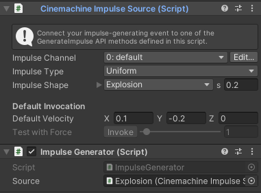
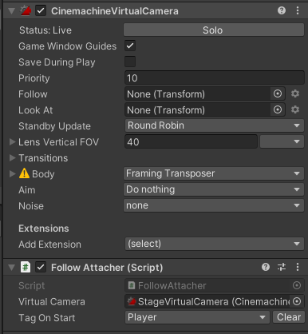
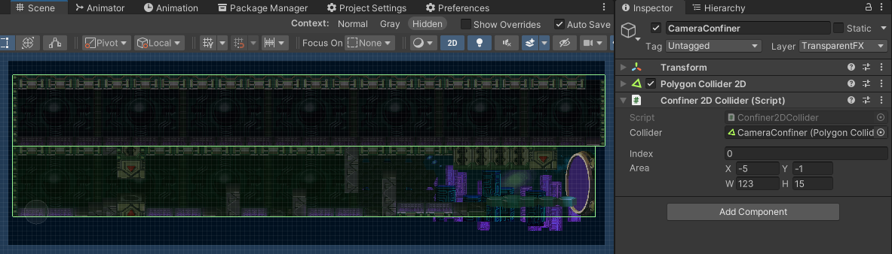
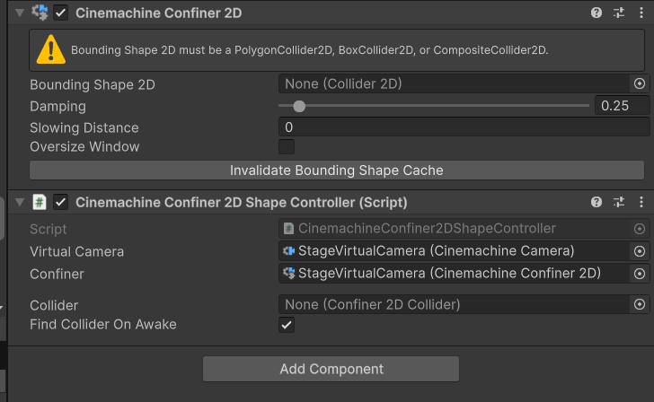

# Cinemachine

* Utility components for Cinemachine.
* Unity minimum version: **6000.1**
* Current version: **1.0.0**
* License: **MIT**
* Dependencies:
	- [com.unity.cinemachine: 3.1.5](https://docs.unity3d.com/Packages/com.unity.cinemachine@3.1/changelog/CHANGELOG.html#315---2025-10-21)

## Summary

Utility components for Cinemachine.

## How To Use

### Using ImpulseGenerator

When enabled, this component generates an impulse using a local **CinemachineImpulseSource**.



Use it on explosions or other Game Objects like that.

> Don't forget to attach a **CinemachineImpulseListener** into your VirtualCamera.

### Using FollowAttacher

At Awake, this component will attach a **Transform** to be followed by the local Cinemachine Camera. The transform will be find using a Tag.



### Using Confiner2DCollider

Creates and edits Rectangle Areas in your Scene.



On your Cinemachine Camera component, add the **Confiner2D** extention, making sure Find Collider On Awake is enabled.

If you are creating a 3D game, use the CinemachineConfiner2DShapeController with CinemachineConfiner2D components.



## Installation

### Using the Package Registry Server

Follow the instructions inside [here](https://cutt.ly/ukvj1c8) and the package **ActionCode-Cinemachine** 
will be available for you to install using the **Package Manager** windows.

### Using the Git URL

You will need a **Git client** installed on your computer with the Path variable already set. 

- Use the **Package Manager** "Add package from git URL..." feature and paste this URL: `https://github.com/HyagoOliveira/Cinemachine.git`

- You can also manually modify you `Packages/manifest.json` file and add this line inside `dependencies` attribute: 

```json
"com.actioncode.cinemachine":"https://github.com/HyagoOliveira/Cinemachine.git"
```

---

**Hyago Oliveira**

[GitHub](https://github.com/HyagoOliveira) -
[BitBucket](https://bitbucket.org/HyagoGow/) -
[LinkedIn](https://www.linkedin.com/in/hyago-oliveira/) -
<hyagogow@gmail.com>